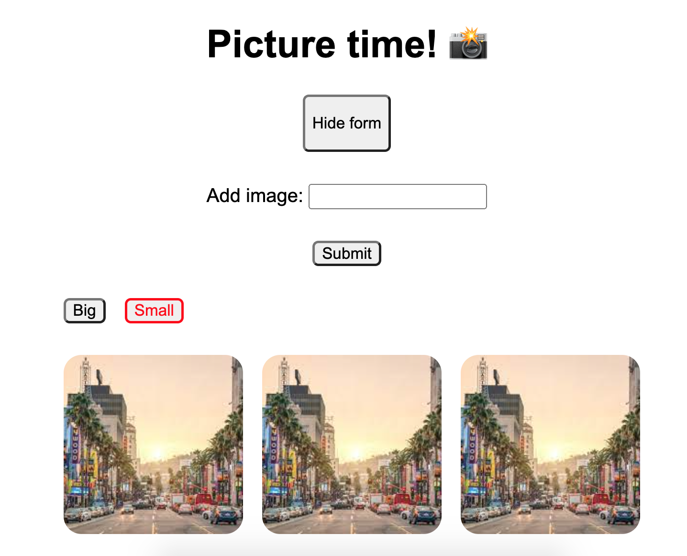
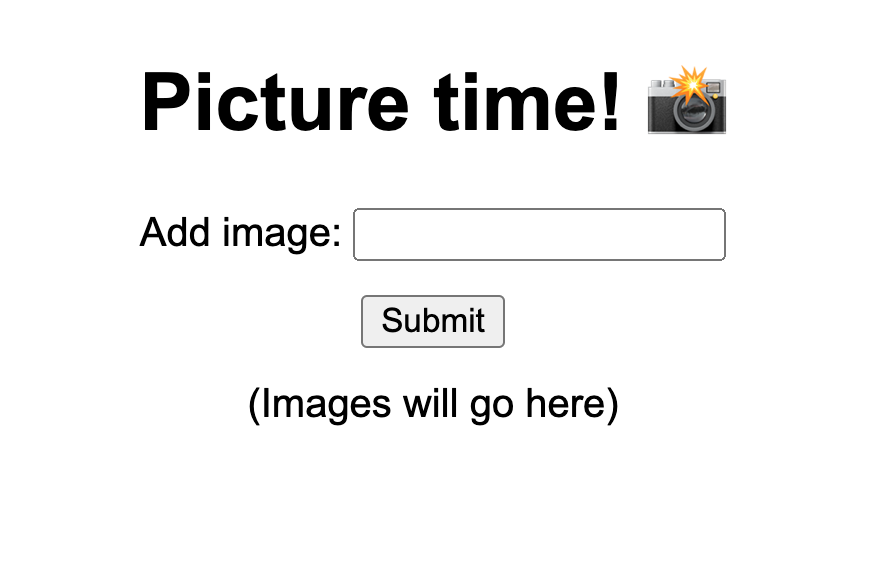
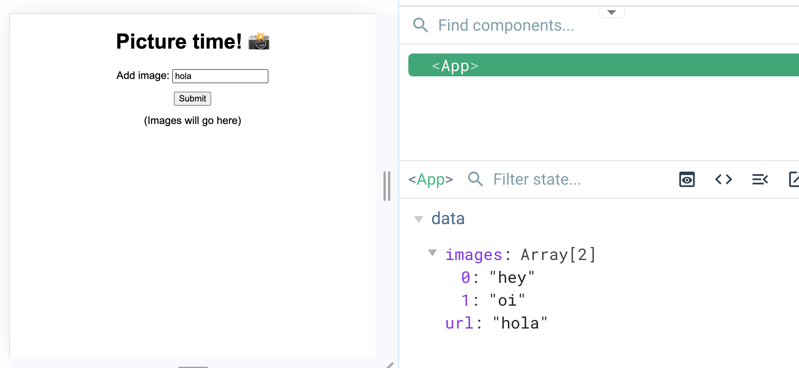
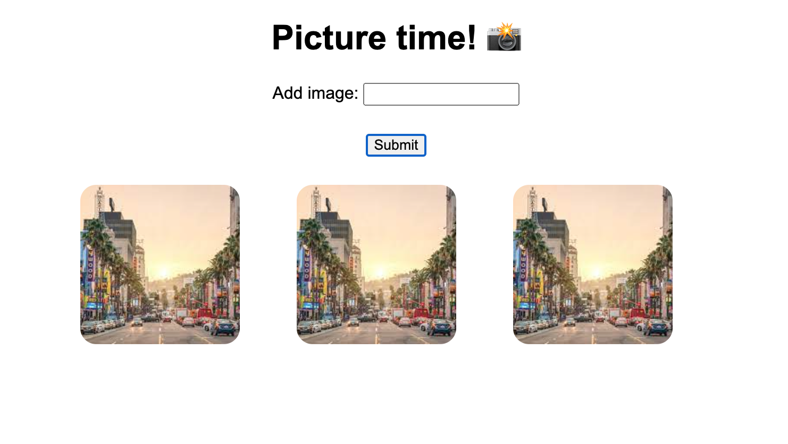
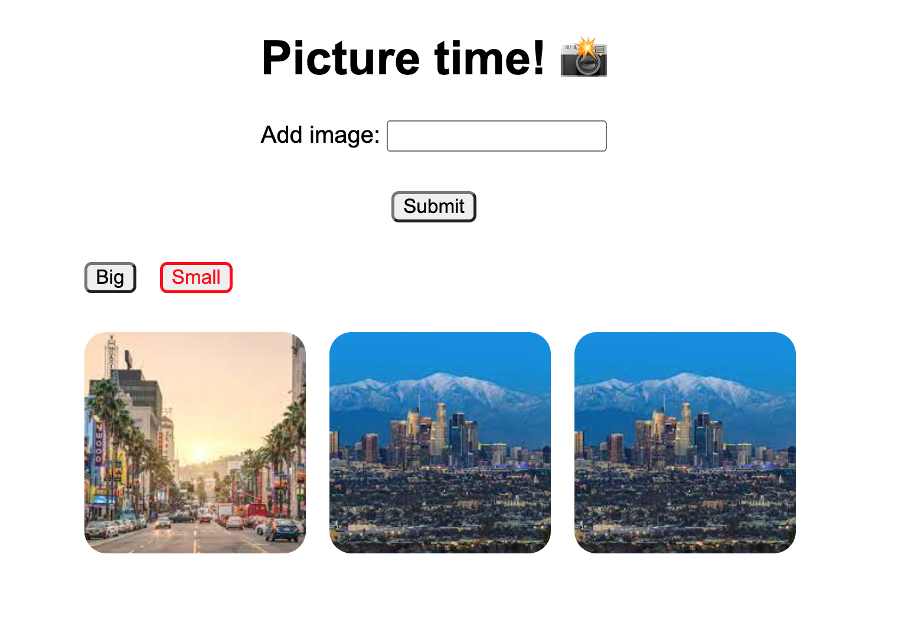
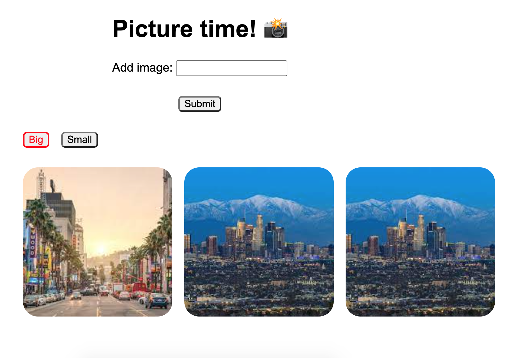
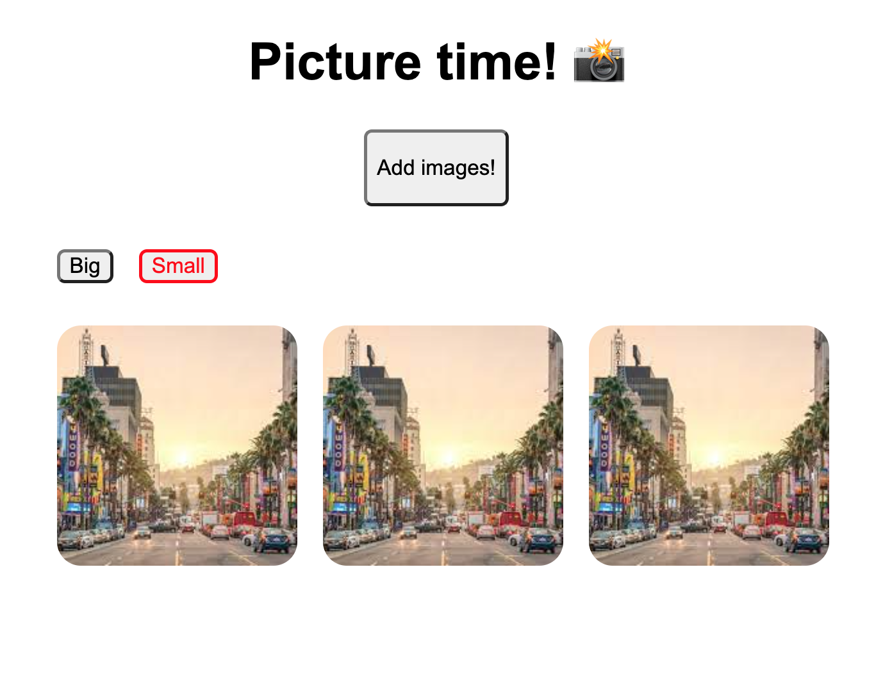

# vue-practice


## Project Setup

```sh
npm install
```

### Compile and Hot-Reload for Development

```sh
npm run dev
```
testt

## Objective
Review and practice basic Vue concepts, including:
- Data binding
- Components
- Passing props
- Conditional styling
- Conditional rendering

We will do this by creating a simple form to display images from URLs, and to be able to make those images larger or smaller by clicking buttons.


## Tasks

### Step 1: Create a form
In App.vue, create a simple form with one text input field and a submit button.

- A text ```input``` field labeled "Add image".
- A ```div``` that will hold images. (No need to add images yet.)
- A "Submit" button.



### Step 2: Add functionality
_Data binding with v-model, and click events_
Add functionality to your "Submit" button - when you click it, it should save your form input (an image URL), to your data.

- Create data called "images", and initialize it as an empty array.
- Add data binding to your input field.
- On button click, push the input into your "images array".


### Step 3: Display your images
_Looping with v-for_
Render all of your saved images in your image grid.

- Using ```v-for```, loop through your "images" data, and create an `````` tag for each one.
- Add some styling so that your images are a manageable size, arranged in a grid, evenly spaced and centered.
- When you add a new image with your "Submit" button, it should appear automatically in your grid.



### Step 4: Separate your image grid into its own component
_Components and passing props_
Our App.vue is getting a little long -  let's separate the image grid into its own component!

- Create a folder called "components", and inside that, create a file called "ImageGrid.vue"
- Move the relevant HTML (the code in `<template>`) for your image grid into that component (and delete from App.vue)
- Make sure you're importing, exporting, and rendering everything correctly:
  - Make sure the structure and names of your new `ImageGrid` file are correct.
  - Import your `ImageGrid` file to App.vue and list it in your components.
  - Render your `<ImageGrid>` component in your App's `<template>`.
  - Pass your "images" data to `ImageGrid` as a prop. Remember you need to pass it down from the App, and receive it in `ImageGrid`.


### Step 5: Conditional styling
In your ```ImageGrid```, create buttons that say "big" and "small".
Clicking the "big" button should make the size of your images bigger. Clicking "small" should return them to their original size.
Whichever size is "active" should be clear in the button styling. i.e. If your images are bigger, the "big" button should be highlighted somehow. If the images are small, the "small" button should be highlighted to show that this is the active state.

- Create data called "isBig" and initialize it to false.
- Create a class ```.active```, and add some styling that will highlight the active button.
- Add conditional classes to your buttons. If "isBig" is true, "big" should be ```.active```. If isBig is false, "small" should be ```.active```.
- Add basic functionality: clicking "small" should set "isBig" to false, and clicking "big" should set it to true.
- In your ```<style>``` section, create a new ```img``` class ```.big```, with a larger image size.
- Add a conditional class to your `````` tags: if "isBig" is true, it should have the ```.big``` class and should appear larger.

Small:
 

Big:


### Step 6: Conditional rendering
_Concepts: v-if and v-else_

Finally, let's use conditional rendering to hide or show our input form. Instead we should show a button saying "Add images!". Clicking the button should show the form.

- In App.vue, create a button "Add images!"
- Create "showForm" data and initialize it to "false"
- Add a `v-if` to your form, so it only renders (aka displays) if "showForm" is true. You should see your form disappear.
- Add a click handler to your "Add images!" button, so it toggles `showForm` between true & false. Now your form should disappear and reappear when you click the button.

Finally, let's clarify our button text: when the form is hidden, the button should say "Add images!" But when the form is showing, let's change the button text to "Hide form"
- Wrap your button text in an HTML tag (like `<p>`, so we have something to add the `v-if` & `v-else` to).
- In the same button, add a second tag of text that says "Hide form"
- Add a `v-if` and `v-else` to your 2 possible button texts: "Add images!" should show when `showForm` is false, and "Hide form" should show when it's true.

Hidden form:


With form:
