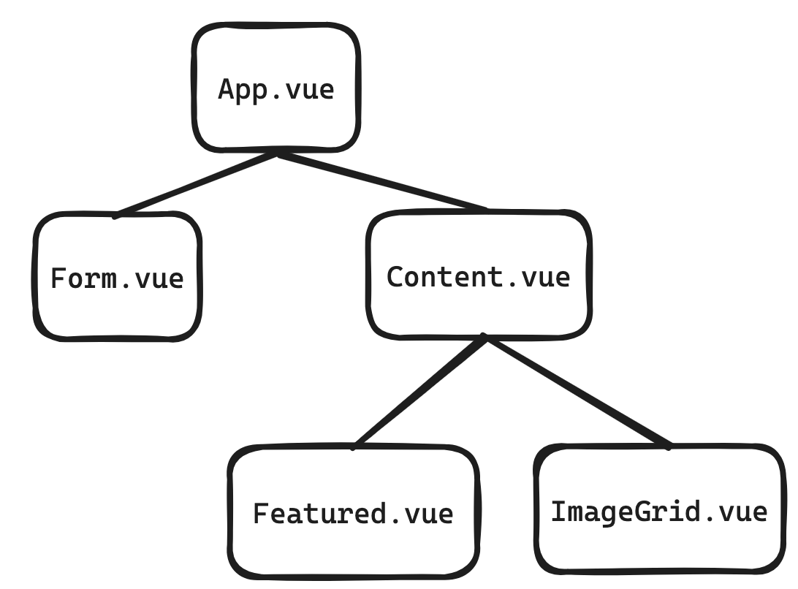
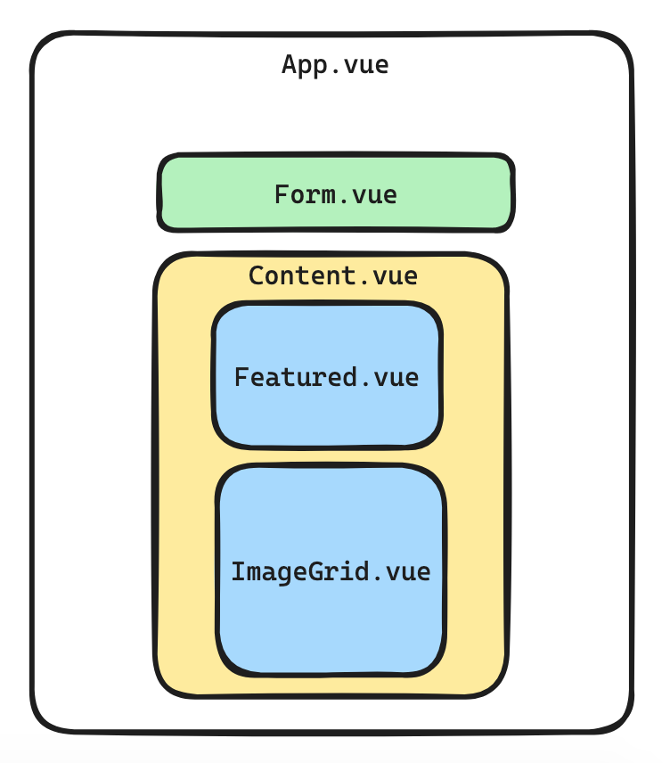
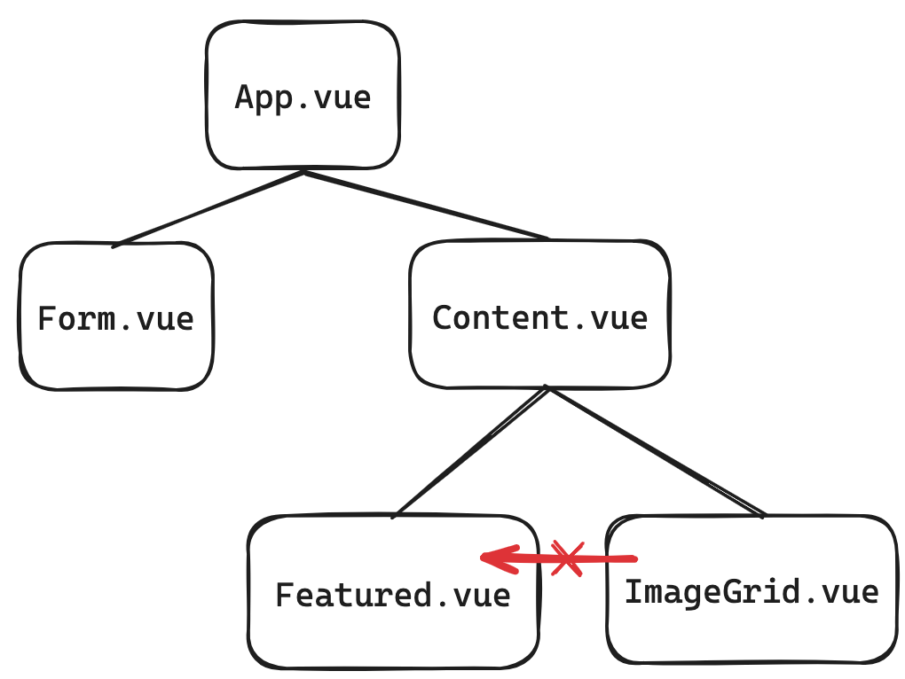
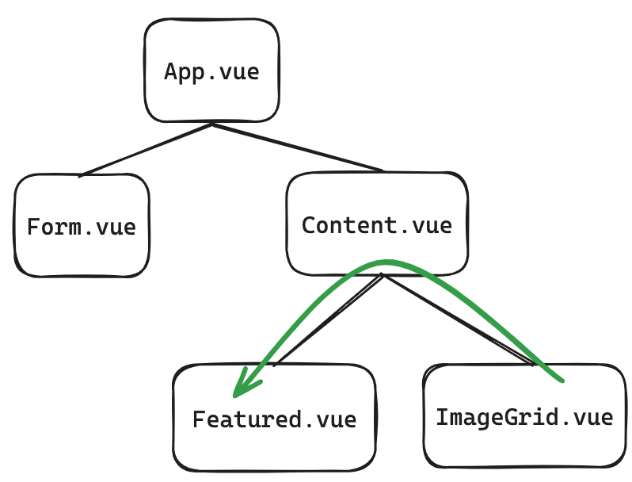

# vue-practice


## Project Setup

```sh
npm install
```

### Compile and Hot-Reload for Development

```sh
npm run dev
```

## Objective

Review and practice intermediate Vue concepts, including:

- Nested components (parents, children, grandchildren)
- Passing props to descendants
- Event emits

Last time, we created a simple form to display images from URLs, and made those images larger or smaller by clicking buttons.
Now we will add:

- Featured image at the top of the photo grid
- Clicking any image in the grid will highlight it as the featured image

## Tasks

### Step 1: Create component structure

_Concepts: [nested components](https://vuejs.org/guide/essentials/component-basics) & [passing props](https://www.w3schools.com/vue/vue_props.php)_

Last time we started coding first, then broke our code into smaller components.

Now that we know how components work, let's start by creating a clean component structure for our code. Each part of our code that serves a different purpose, will have a different component:

- form
- image grid
- featured image

Let's also group together the image grid and featured image components into a parent called "Content".

You could visualize your component structure like this:

Or this:


To accomplish this:

- In your `components` folder, create files called
  - `Form.vue`
  - `Featured.vue`
  - `Content.vue`
- Move the code for your form (including the "Add images" button) into `Form.vue`

- For all of your new files, make sure the structure (`<template>`, `<script>`, `<style>`) and names (in your `export`s) are correct.

- Connect all your components:
    1. `import` the component to its parent.
    2. List the component in the parent's `components`
    3. Render the component in the parent's `<template>`
- Pass all your props:
    1. Pass props _down_ to child component(s) by including them _inside_ the component tag in the `<template>`. Ex:

    ```Vue
    <ImageGrid :images="images" />
    ```

    2. _Receive_ props in the child component by listing them in `props`. Ex:

    ```Vue
    props: ['images']
    ```

### Step 2: Connect your form

_Concept: [Event emits](https://vuejs.org/guide/components/events.html)_

Now we have a problem: our form is no longer working! Can you see why?

It's trying to push to `images`. But that's in `App.vue`, while our form is now in a separate component.

To fix this, we need to pass information _up_ from our child component (`Form.vue`), to the parent (`App.vue`).

We can do this with props and event emits:

- In your `<Form>` component, make sure you're saving the input url in your `data` 
- Add an `$emit` to your form submit, passing a name of your event, and your `url`.
- In the parent `App.vue`, add an event listener to your `<Form>` component. When it "hears" your Form's submit event, it should run the `addImage()` function. 
  - For example, if you named your `Form`'s `$emit` event "submitted", your `App` should listen for `@submitted`. 
  - `addImage()` should accept the url as a parameter.

### Step 3: Create a Featured Image 

_Concepts: [passing props](https://www.w3schools.com/vue/vue_props.php), [event emits](https://vuejs.org/guide/components/events.html), [conditional render](https://vuejs.org/guide/essentials/conditional.html)_

Let's build our featured image. 

Remember:

- We will need to click an image in our `ImageGrid` component, and have it appear in our `Featured` component. So we'll need to pass some data around.
- When we're passing data throughout app, we need to follow the connections in our app's tree structure. This means that we _cannot_ pass data directly between sibling components. We need to pass through the _lowest common ancestor_:



Let's break this down into some sub-steps:

1. Create a variable in your `Content`'s `data` to hold your `featured` image URL.

2. Add an `@click` and event `$emit` to all ``s in your `ImageGrid` component: when an image is clicked, it should `emit` that URL.

3. Add an event listener to the `<imageGrid>` component in the parent `Content`. When it "hears" your image click event, it should update your `featured` value to the received URL.

4. Pass the `featured` URL down as a prop to your `<Featured>` component. Remember to receive it in the child component `props` too.

5. In your `Featured.vue` component, render your featured image. This should only register _if_ a featured image has been set. Otherwise, nothing should show.
